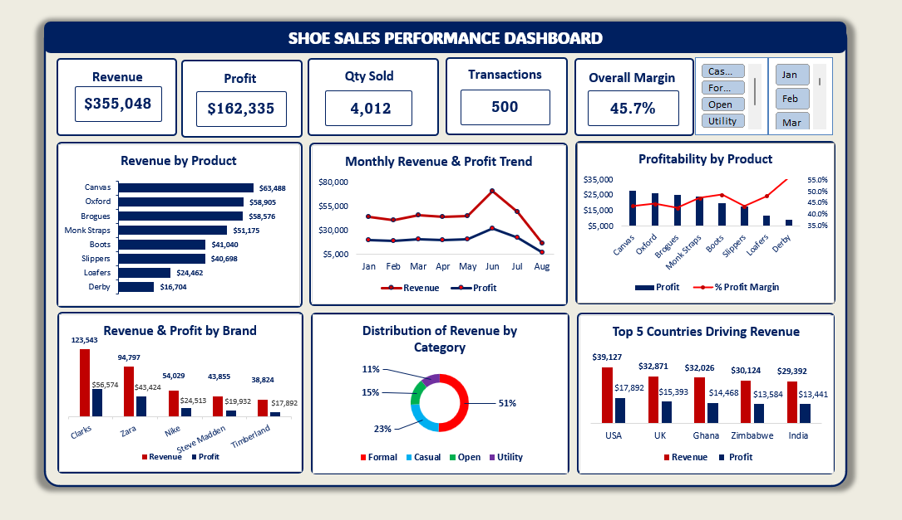

# Sales Performance Dashboard (Excel)

An Excel dashboard analysing shoe sales performance : revenue, profitability, product mix, brand and category performance, geography, and payment patterns. Built using  Power Query, PivotTables, and PivotCharts.



### Tools Used
**Microsoft Excel** :
- Data Cleaning: Power Query, calculated fields, VLOOKUP
- Data Analysis: PivotTables, Formulas, Conditional formatting, PivotCharts

### Business Questions

1. How is the business performing overall?
2. How have revenue and profit changed over time?
3. Which products are driving sales?
4. Which products are driving profitability?
5. Which categories and brands perform best?
6. Which countries contribute the most to the business?
7. What purchasing patterns can we identify from payment method and product preferences?
8. What actions should management take based on the findings?

### Key Findings based on business questions

**1. How is the business performing overall?**<br>
500 transactions generated $355,048 in revenue and $162,335 in profit (45.7% overall margin), across 4,012 units sold.

**2. How have revenue and profit changed over time?**<br>
Both climbed steadily from January through May, spiked sharply in June ($70,771 revenue, profit of $32,123; the highest of any month), then fell just as sharply through July into August, which closed at just $16,041 revenue and $7,355 profit; the steepest drop in the dataset. Worth confirming whether August reflects a partial month of data or a genuine seasonal dip before treating it as a trend.

**3. Which products are driving sales?**<br>
Canvas ($63,488), Oxford ($58,905), and Brogues ($58,576) are the top 3 by revenue, together accounting for 51% of total sales.

**4. Which products are driving profitability?**<br>
The same top 3 (Canvas, Oxford, Brogues) also lead on raw profit dollars, contributing 49% of total profit but Derby stands out on efficiency: lowest revenue ($16,704) and lowest profit ($9,396) of any product, yet the highest profit margin by far (56.3%, vs. a 45.7% overall average). Profit volume and profit efficiency point to different products.

**5. Which categories and brands perform best?**<br>
Formal is the dominant category at 51% of revenue, with Casual (23%) as the clear secondary lane and Open (15%) and Utility (11%) remaining as smaller, specialized categories. On brands, Clarks leads clearly ($123,543 revenue, $56,574 profit), followed by Zara ($94,797/$43,424); Timberland trails the group at $38,824.

**6. Which countries contribute the most to the business?**<br>
USA ($39,127), UK ($32,871), Ghana ($32,026), Zimbabwe ($30,124), and India ($29,392) are the top 5, contributing $163,540 combined, 46% of total revenue. The spread is fairly even rather than dominated by one market.

**7. What purchasing patterns can we identify from payment method and product preferences?**<br>
No broad, business-wide correlation between payment method and product. Two isolated exceptions stand out: Canvas skews heavily toward Bank Transfer and away from Mobile Money, and Monk Straps skews toward Cash; neither strong enough to justify a single payment-method strategy.

**8. Recommendations**
- Prioritise inventory and marketing spend on `Canvas`, `Oxford`, and `Brogues` which already contribute to ~half of both revenue and profit.
- Scale `Derby` deliberately (e.g. better placement/visibility) given its highest profit margin relative to its current low volume.
- Review `Timberland's` continued assortment given its poor performance from the other four brands.
- Protect the `Formal` category while treating Casual as the clear growth lane; assess Open/Utility before further investment.
- Diagnose the August drop before the next planning cycle, and look to replicate whatever drove June's revenue peak.
- Skip a broad payment-method campaign; address the `Canvas/Monk Straps` patterns individually if at all.
- Continue diversified geographic expansion rather than concentrating on any single top-5 country.

### Data Cleaning Notes

- Raw data contained inconsistent text casing across `Category`, `Brand`, and `Product` fields (e.g. "Formal" / "FORMAL" / "formal" treated as separate values); standardized using Power Query.
- Added calculated fields: Cost Price, Selling Price, Cost, Revenue, Profit, and Profit Margin %.
- The `products` sheet (product names, cost price, selling price) is intentionally duplicated in both `sales_data_raw.xlsx` and `sales_data_analysis.xlsx`, since VLOOKUP formulas in the analysis workbook reference it locally.
- Using a simple average of row-level percentages gave a 47.1% margin, because it skewed results toward low-volume transactions.
- To correct this, Profit Margin % was calculated as **SUM(Profit) ÷ SUM(Revenue)** at each grouping level to reflect the actual average margin.

### Repo Structure

```
sales-performance-dashboard-excel/
├── README.md
├── data/
│   └── shoe_sales_data_raw.xlsx          (sheets: shoe_sales_data_raw, products)
├── analysis/
│   └── shoe_sales_data_analysis.xlsx     (sheets: products, shoe_sales_data_clean, analysis, dashboard)
├── charts/
│   ├── 01_overall_performance.png
│   ├── 02_revenue_profit_trend.png
│   ├── 03_products_driving_sales.png
│   ├── 04_profitability_by_product.png
│   ├── 05_brand_category.png
│   ├── 06_top_countries.png
│   ├── 07_payment_patterns.png
│   └── 08_dashboard.png
└── LICENSE
```

### How to Use

1. Clone or download this repo.
2. Open `analysis/shoe_sales_data_analysis.xlsx`.
3. Go to **Data → Refresh All** to rebuild the PivotTables from source data if needed.
4. View the `analysis` sheet for each business question's table-and-chart pair, or the `dashboard` sheet for the full combined view shown above.

##### *Credit:* *The Complete Excel Data Analysis Workflow [webinar](https://www.youtube.com/live/28JRwAWL_qg). Organised by Esther Anagu | Founder, Learned 2 Hired and Edmond Nathan | Zen Analytics Hub*
###### Built by following along then completed independently using the raw dirty dataset provided.
